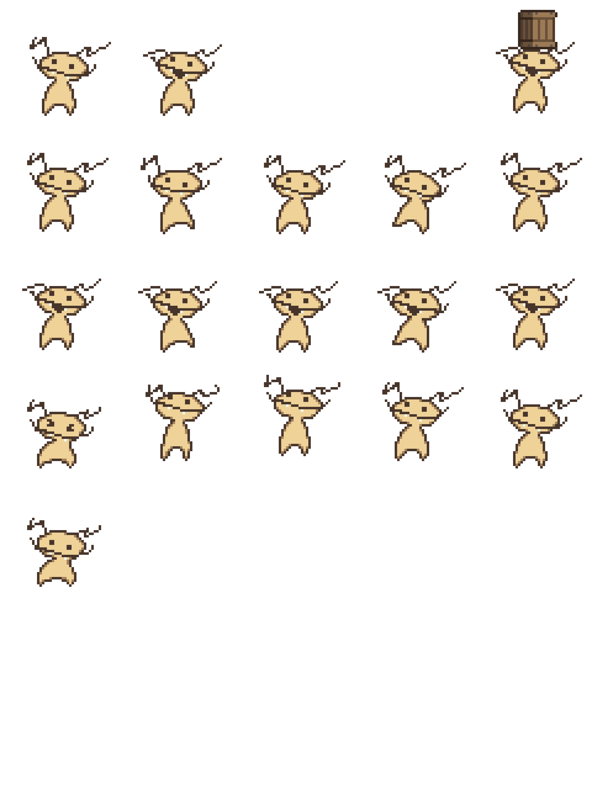
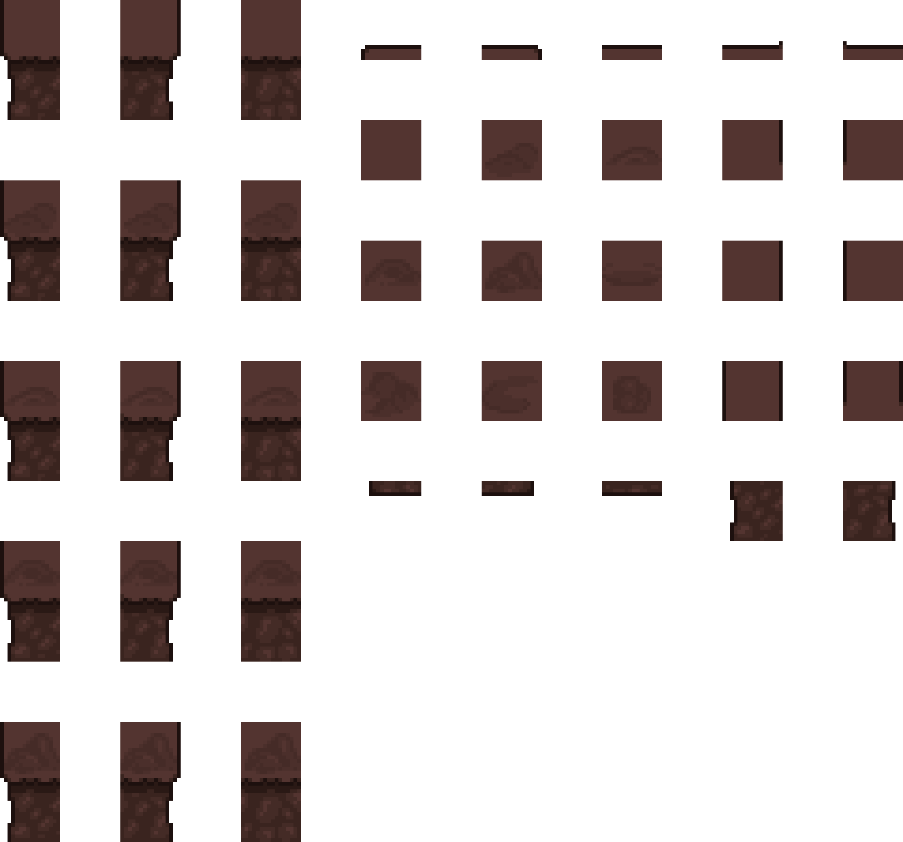
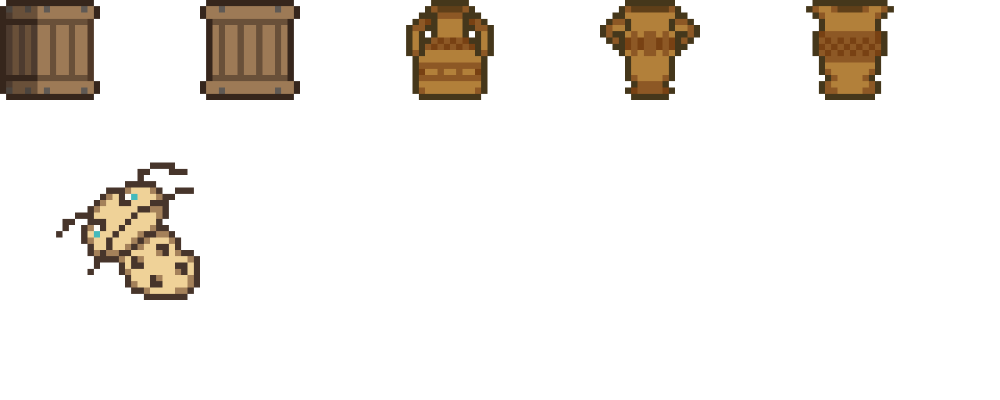
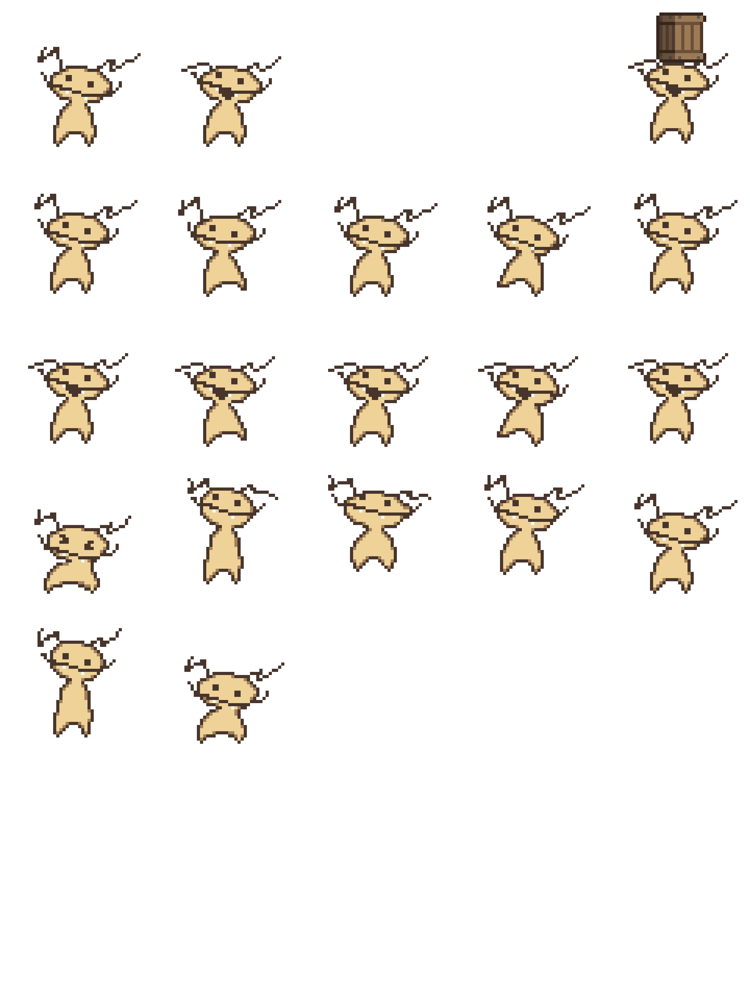

# Grub Gets Grubs in Gravity Town – Group Interactive Project

## Introduction 

- Our team for the Group Interactive Project was assigned to create a videogame with a unique controlling mechanic. While others were given prompts such as Virtual Reality or Augmented Reality, we decided to go with Gyroscopic controls. 

- For me, gyroscope has always brought a very child-like sense of wonder to videogames it’s implemented in. Games such as The Legend of Zelda: Breath of the Wild,Splatoon, and Mario Party have, thanks to the gyro controls, always incredibly fun and interactive, with gyro allowing for a certain level of immersion over the game world that might be hard to replicate otherwise. As a long-time Nintendo fan and somebody whose earliest childhood gaming experiences were with the Nintendo Wii, an era where their creativity was at an all-time high, I felt excited to work on a project with this prompt.

- As a team, we set out to explore how gyroscopic input could enhance gameplay beyond novelty, aiming for meaningful use of the mechanic and immersion. From the beginning, we knew that the gyro mechanic needed to be essential to the gameplay, otherwise it might serve to drive players away. This goal guided our design choices; We were particularly interested in how physical movement could translate into this control scheme, creating a deeper connection between the player and the game world.

---

## 1. Time Planning

- Early in the project, our team established a rough timeline broken down into phases: concept development, prototyping, production, iteration, and final implementation. Each stage had specific goals and outputs, ensuring we kept the momentum going throughout. 

- Research
- Concept Sketches
- Production
- Finalising

- With experience on previous projects, I knew that I needed to take my time, and iterate on my art, as opposed to rushing straight to production and finalising too quickly. Especially with another artist on the team, this forced us to make sure our core idea was strong enough to support itself.  

- One big obstacle for me, as well as the rest of the team, was the Easter Break. It was definitely a concern, as being away from the team, as well as not having the regular schedule of classes, would make development rocky at best. It was a tough hurdle to overcome, as we found it harder and harder to schedule time for weekly check-ins with the rest of our team for a strong sense of teamwork. 

- In the research phase, me and my fellow artist researched genres, artstyles, and concept art that we felt would match the game's controls. We knew we wanted the game to have a loose-fitting feel to it, being cartoonish, dramatic, and overall care-free. Inspired by games such as Super Mario Bros Wonder, a game renowned for its cartoony art style yet careful attention to detail,  we began to craft ideas for worlds, characters, and assets.

- By week two/three, we had moved onto the first concepts for our character and game world. Drawing inspiration from popular bug-focused media, such as Bug Fables and Hollow Knight, we slowly began solidifying the direction that we wanted our game and assets to follow. Very early on, we settled on a character design and name: Grub. We quickly fell in love with the character, and from there, created the rest of our assets.

- The production phase followed, where the task load increased. I was making rough concept sketches, primitive first iterations for the player sheets, and creating some basic ideas for objects our character could interact with. We decided that a tileset for our overworld wasn’t on our priority list for the moment, as well as other non-playable characters such as bosses or allies, so we postponed the production of those for now.

- Finally, in the iteration and implementation stages, I returned to older assets with the goal of polishing and touching up animations and tilesets based on testing feedback. 

---

## 2. Demonstration of Research

- After talking to my team, we decided to sit down and plan the game out on a whiteboard, as well as draw some concept art. After much deliberation, we finally decided on the core idea of our game: a 2D platformer with a rotating world. By using the controller’s gyro controls, the player can rotate the world around them, shifting the gravity and allowing players to reach new places, drop items, and navigate around in a full 360 degree of movement. The levels would take more of a puzzle-platformer approach, inspired by other games in the genre, like Portal and Fez.
- The game would feature a 2D pixel art style, using a more muted, oily colour palette for the backgrounds, and something more vibrant for players and items. Our visual inspiration came from other pixel art titles that emulate a similar look, such as Super Mario World and Terraria. We also drew from early animation styles, incorporating fluid, rubber-hose-inspired movements to give characters a bouncy, expressive quality. This animation style not only added charm but also emphasized motion and interaction, something we deemed important to draw attention to in a game where the world itself was constantly shifting.
- Our goal was to make sure that the visual identity of the game complemented the gameplay. Since the game revolved around rotating the world, we had to consider how the art would read from multiple orientations. Platforms, obstacles, and environmental elements were all designed with rotation in mind—clear silhouettes, consistent shading, and intuitive visual cues were a must, so that all objects and ground elements would be clearly readable from every angle.

---

## 3. Production of Assets

- Next was creating the assets. I made the player animations fairly quickly, just to get the idea working and implemented into the game as soon as possible. Although I wanted the character to be bouncy and nonsensical, these early versions lacked any kind of complexity.

- After attempting to add some squash, stretch, and follow-through, I quickly realised that I was in over my head. Having very minimal experience with animation and frustrating myself that I couldn’t make it look like I wanted, I decided to go back to the drawing board, and study the techniques of animation a little further.

- After spending some time with it, I soon realised that in order to create the animation, I’d have to squash and stretch Grub’s face, something I was hesitant to do as I believed it may hurt the readability and silhouette of the character. However, after looking at squash and stretch in 2D platformers such as Super Mario Bros Wonder, I quickly realised that the effect didn’t take away from the character’s instant readability, so I decided to revisit it and iterate with a fresh mindset, which got me to make this:

- After taking some time and comparing the two versions, I could finally tell that I was making steady improvement with my assets and was beginning to reach a place I was pretty happy with, although I knew I was far from done. I decided now to begin working on an overworld tileset. While originally we had planned for the overworld to deviate from the regular pixel at style and instead go for a 3D low-poly style, I quickly realised this was slightly out of my scope of capabilities for this project, so the idea had to unfortunately be shelved. Taking heavy inspiration from Deltarune and Super Mario Bros World, I began to work on an underground-themed tileset, including some swappable tiles that feature decorations, I landed on this design:

- 

- I then began work on the item sheet as well. Taking basic inspiration from Spelunky, I added some base items such as boxes and vases. A suggestion for a collectible from our coders was a small, baby grub, which the player would have to collect to beat the stage. With all of this in mind, I created these objects:

- 

## 4. Finalising / Iteration

- After completing the initial version of Grub’s jumping animation, I shared it with a few friends for feedback. One consistent rhetoric was that the antennae should bounce along with Grub’s movement. This was actually something I had planned to implement early on, but had forgotten to implement. Once it was pointed out, it immediately made me realise why it felt incomplete, so I went back into the animation and added motion to the antennae, giving them a subtle bounce and follow-through as Grub jumped and landed. This small addition made a huge difference in making the character feel more dynamic and alive.

- With the main production phase largely finished, I shifted focus to refinement and iteration. I revisited all of Grub’s animations—jumping, walking, and idle—and examined the timing of each frame. While the animations were expressive, I noticed that leaving all frames at equal intervals resulted in some movements feeling unnatural and not having enough flow. I experimented with adjusting the timing on specific frames, such as lingering slightly longer on the anticipation or landing frames to better convey weight and impact. These subtle changes added smoothness and improved the overall flow of the animations.
- Throughout this phase, I also paid closer attention to feedback from my team and test players. Whether it was polishing sprite outlines, or ensuring animations flowed seamlessly during gameplay, I aimed to fine-tune every detail. This final stretch was less about big changes and more about subtle enhancements that elevated the overall quality and polish of the project.

## 5. Implementation

- Now that everything was finally produced, it was time to integrate it into the game. By this point, our coders had already added support for Unity to display sprite animations using placeholder art, so it was as simple as adding the images, assigning them correctly, and doing some final adjustments. One issue I ran into was frame aligning; Even though I had specific timings for my frames to display in Aseprite, Unity had no native way of doing this for me, so it took a little time to manually tinker with the way the player sprites were handled to get the timings to match up.

- Another small but important task was making sure the transitions between animations—like from idle to jump, or walk to fall—felt natural in gameplay. I fine-tuned these transitions, adjusting blend times and animation conditions so that Grub's movements flowed smoothly and didn’t feel jarring. Once everything was in and working properly, it was incredibly satisfying to see the character I had drawn and animated brought to life inside the game environment.

## 7. Conclusion

- In conclusion, Grub Gets Grubs in Gravity Town was one of the most creatively challenging yet rewarding projects I’ve worked on. Working with gyroscopic controls pushed us to think outside the box and create a gameplay experience where the mechanic wasn’t just a gimmick, but something that defined the identity of the game. I’m especially happy to create artwork that not only feels expressive, but other people also agree is enjoyable and easy to read.
- Part of our project was to present this game at an expedition, which went a lot better than I’d originally thought. Many people told us our concept for the game was incredibly fun, and this was a game they’d consider playing (even people who don’t typically play games!) which was hugely inspiring to me. This means that our concept both had legs to run on in terms of being advanced enough to create a game around, but felt accessible enough for anybody to approach, which is the way I intended the gimmick to be. 
- Most importantly, this project reminded me of the innovation that’s possible within game making. Sometimes, a lot of game ideas come from being “derivative”, whether that be for artstyle, genre, or gameplay mechanics. However, a large majority of our gameplay loop didn’t feel directly inspired by anything, and yet still reflected successful games within the puzzle genre, and lead to something that was truly unique, and a game that I would genuinely be interested in, which is a large goal for me when it comes to making games and assets.

